<div align="center">

<pre>
     ▄▄█▄    ▄▓  ▄    ▄▄▄░   ▄▀░█▄   ▄▄        ▄▄█▄       ▄
   ▄░▀ ▓▒░▀ ▓░▒▌ ▒█▄ ▀▒█▀░█▄ ▀▀▀ ░▀▀▓▀▓█▄   ▄░▀ ▓▒░▀ ▀▓▀▀▀▒█▄
  ▀░▓▄ ░▀   ▀▓▒ ▓▒▀  ▄▒  ▓░▀ ▀░▒▓▀ ▄░▓ ▓░▀ ▀░▓▄ ░▀    ▄░   ▓█▌
  ▐▓█  ▄    ▓█▀▓▒▄  ▒▓█░▀▀   ▒▓█  ▒▓█▄▀▒▄  ▐▓█  ▄    ▀░▓  ▒▓█
   ▀█▄▀▓░▀ ▀░█  ██▌ ░█▒    ▄▓█░▄  ▓██▀ ▓█░  ▀█▄▀▓░▀  ▐▒▓ ▄▓▒▀
     ·  ▀    ▀  ░▀   ▀░      ░▀   ▀░█  █▀      ▀      ░▒▀▀
</pre>


<br><br>



</div>

<br>

## `[ 01 ] ABOUT`

```
┌──────────────────────────────────────────────────┐
│ handle ..... Expired                             │
│ github ..... pastexpirationdate                  │
│ vibe ....... scene/warez, linux ricing, and etc  │
│ builds ..... small single-file tools, weird stuff│
│ status ..... inactive but here sometimes         │
└──────────────────────────────────────────────────┘
```

I like building tiny tools that run anywhere, messing around with computers and phones, and making music sometimes.

<br>

## `[ 02 ] PROJECTS`

```
 #  FILENAME              DESCRIPTION
 ── ───────────────────── ─────────────────────────────
 01 SAME_DECODER.HTML     EAS / SAME code decoder, one
                          file, FIPS + VTEC, old-school
                          EAS style UI
 02 DOTFILES.ZIP          CachyOS + KDE rice, kitty,
                          fish, custom fastfetch
                          [ coming soon ]
```

**[>> SAME Code Decoder <<](https://github.com/pastexpirationdate/EAS-SAME-Code-Encoder-and-Decoder)**

<br>

## `[ 03 ] SYSTEM`

```
╔══════════════════ SYSTEM ══════════════════╗
║ OS ........ CachyOS                        ║
║ DE ........ KDE Plasma (Wayland)           ║
║ Shell ..... fish                           ║
║ Terminal .. kitty                          ║
║ Machine ... Acer Nitro AN515-51            ║
╚════════════════════════════════════════════╝
```

<br>

## `[ 04 ] RELEASE INFO`

```
▄▄▄▄▄▄▄▄▄▄▄▄▄▄▄▄▄▄▄▄▄▄▄▄▄▄▄▄▄▄▄▄▄▄▄▄▄▄▄▄▄▄▄▄▄▄▄▄▄▄▄▄▄▄
 
 RELEASE ..... pastexpirationdate.README-DARK-2026
 GROUP ....... EXPIRED
 TYPE ........ profile readme
 FORMAT ...... markdown, 1 file
 THEME ....... github dark
 PROTECTION .. none
 QUALITY ..... not that good tbh
 
▀▀▀▀▀▀▀▀▀▀▀▀▀▀▀▀▀▀▀▀▀▀▀▀▀▀▀▀▀▀▀▀▀▀▀▀▀▀▀▀▀▀▀▀▀▀▀▀▀▀▀▀▀▀
```

<br>

## `[ 05 ] TECH`

<div align="center">


</div>

<br>

## `[ 06 ] STATS`

<div align="center">


<br>


<br>


<br><br>


</div>

<br>

## `[ 07 ] CONNECT`

<div align="center">

<a href="https://discord.com/users/865988577065304065">
  
</a>

<br><br>

<a href="https://github.com/pastexpirationdate"></a>
<a href="https://discord.com/users/865988577065304065"></a>
<!-- add more socials here, same style, e.g.
<a href="https://youtube.com/@YOURHANDLE"></a>
<a href="https://twitter.com/YOURHANDLE"></a>
-->

</div>

<br>

## `[ 08 ] GREETS`

```
 greets fly out to everyone reading this text
 that find my person interesting, and like me,
 like to challenge the obvious & the "normal".
```

<div align="center">

```
░▒▓█ [ S I N C E  2 0 0 4 ] █▓▒░
```

</div>
